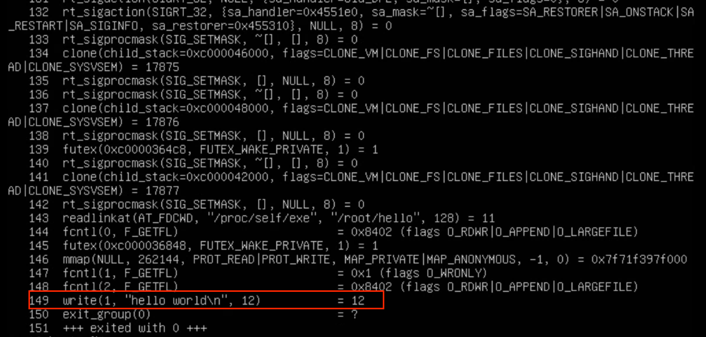
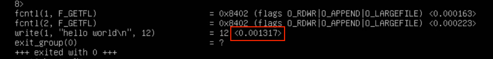
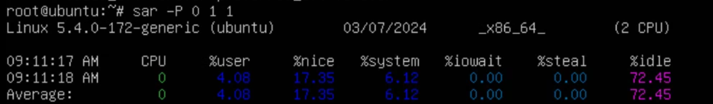

# 커널

- 커널은 프로그램이다.
- 커널의 역할
  - 프로세스가 하드웨어에 직접 접근할 수 없게 한다.
  - 커널은 CPU의 모드mode를 사용하여 프로세스의 접근을 막는다.
    - CPU의 아키텍처마다 다양한 모드가 존재함
    - 리눅스는 두 개의 모드 사용
      - 사용자 모드
        - 실행 명령어 제약 있음
      - 커널 모드
        - 실행 명령어 제약이 없음
    - 커널은 커널 모드, 프로세스는 사용자 모드로 동작
      - 프로세스는 커널을 통해서만 하드웨어에 간접적 접근 가능

# 시스템 콜

- 시스템 콜(system call): 프로세스가 커널에 처리를 요청하는 방법
  - CPU에 예외exception 이벤트를 발생시킨다.
    - 사용자 모드에서 처리하던 프로세스 동작을 멈추고 커널모드로 전환
    - 작업이 완료 되면 사용자 모드로 돌아와 다시 프로세스 동작 재개
  - 시스템 콜을 통해서만 CPU 모드를 변경시킬 수 있음

## strace

- 특정 프로세스의 시스템 콜과 시그널을 추적하는 툴

```bash
$ strace -o hello.log ./hello
# -o 옵션 파일 저장
$ strace -T -o hello.log ./hello
# -T 옵션 걸리는 시간 확인
```

```bash
$ cat -n hello.log
```



- `write()` 시스템 콜 호출
- 내 환경에서는 시스템콜이 150번 이루어졌다.



- `-T` 옵션 실행 결과

## sar

- 논리 CPU가 실행하고 있는 명령어 비율

```bash
$ sar -P 0 1 1
# 0 코어 CPU의 데이터를 1초간 1번 수집
```



- 사용자 모드 프로세스 실행 시간 비율
  - `%user` + `%nice`
- 커널 시스템 콜 처리 시간 비율
  - `%system`
- 아무것도 하지 않은 시간 비율
  - `%idle`

### 예제 1

```python
#!/usr/bin/python3
import os

while True:
    os.getppid()
    # 부모 프로세스 ID 얻기
```

```bash
$ taskset -c 0 ./syscall-inf-loop.py &
# 0번 CPU에서 해당 명령어 실행
$ sar -P 0 1 1
Linux 5.4.0-172-generic (ubuntu)        03/07/2024      _x86_64_        (2 CPU)

09:26:23 AM     CPU     %user     %nice   %system   %iowait    %steal     %idle
09:26:24 AM       0     78.00      0.00     22.00      0.00      0.00      0.00
Average:          0     78.00      0.00     22.00      0.00      0.00      0.00
```

- `getppid()`로 인해 계속해서 시스템 콜을 호출함

# 라이브러리

- GNU 프로젝트 제공 리눅스 표준 C 라이브러리 → glibc

  - `libc`라고도 한다.
  - C 언어로 작성된 프로그램은 libc를 링크한다.

- libc는 표준 C 라이브러리 뿐만 아니라 시스템 콜 래퍼 함수도 제공한다.

## ldd

- 프로그램이 어떤 라이브러리를 링크하는지 알아볼 수 있는 명령어

```bash
root@ubuntu:~# ldd /bin/echo
        linux-vdso.so.1 (0x00007ffdfe5ea000)
        libc.so.6 => /lib/x86_64-linux-gnu/libc.so.6 (0x00007fc55141f000)
        /lib64/ld-linux-x86-64.so.2 (0x00007fc551629000)
```

- `libc`를 링크하고 있다. - 표준 C 라이브러리

```bash
root@ubuntu:~# ldd /usr/bin/python3
        linux-vdso.so.1 (0x00007ffe2cdea000)
        libc.so.6 => /lib/x86_64-linux-gnu/libc.so.6 (0x00007fca5021e000)
        libpthread.so.0 => /lib/x86_64-linux-gnu/libpthread.so.0 (0x00007fca501fb000)
        libdl.so.2 => /lib/x86_64-linux-gnu/libdl.so.2 (0x00007fca501f5000)
        libutil.so.1 => /lib/x86_64-linux-gnu/libutil.so.1 (0x00007fca501f0000)
        libm.so.6 => /lib/x86_64-linux-gnu/libm.so.6 (0x00007fca500a1000)
        libexpat.so.1 => /lib/x86_64-linux-gnu/libexpat.so.1 (0x00007fca50073000)
        libz.so.1 => /lib/x86_64-linux-gnu/libz.so.1 (0x00007fca50055000)
        /lib64/ld-linux-x86-64.so.2 (0x00007fca5041d000)
```

- 파이썬 프로그램을 실행할때 내부적으로 C 라이브러리를 사용함을 알 수 있음

- 시스템 콜 레퍼 함수

  - 시스템 콜은 어셈블리 코드를 사용해서 호출할 수 있다.
    - 아키텍처에 의존

- 정적 라이브러리 vs 동적 라이브러리
  - 프로그램을 결합하는 방식의 차이에 따라 정적 동적으로 나뉜다.
  - 정적 라이브러리는 링크 과정에서 라이브러리의 함수를 프로그램에 집어 넣음
  - 동적 라이브러리는 링크 과정에서 '이 라이브러리의 어떤 함수를 호출한다'는 정보만 넣음
    - 프로그램 시작 혹은 실행 중에 해당 라이브러리를 메모리에 로드하고 호출한다.

```bash
$ vi pause.c
$ cc -static -o pause pause.c
$ ls -l pause
-rwxr-xr-x 1 root root 871832 Mar  6 10:13 pause
root@ubuntu:~# ldd pause
        not a dynamic executable
# 정적 라이브러리 사용
```

```bash
$ cc -o pause pause.c
$ ls -l pause
-rwxr-xr-x 1 root root 16696 Mar  6 10:15 pause
$ ldd pause
        linux-vdso.so.1 (0x00007ffd399f2000)
        libc.so.6 => /lib/x86_64-linux-gnu/libc.so.6 (0x00007ff4d17a5000)
        /lib64/ld-linux-x86-64.so.2 (0x00007ff4d19a9000)
# 동적이기 때문에 링크된 라이브러리 확인 가능
```

```bash
root@ubuntu:~# ldd hello
        not a dynamic executable
```

- go 언어는 정적 링크를 사용한다.

# Ref

[그림으로 배우는 리눅스 구조](https://product.kyobobook.co.kr/detail/S000208795616)
