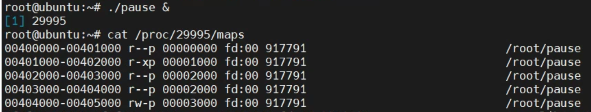
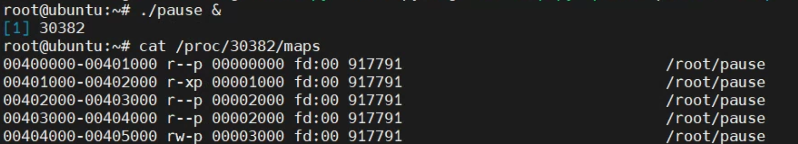
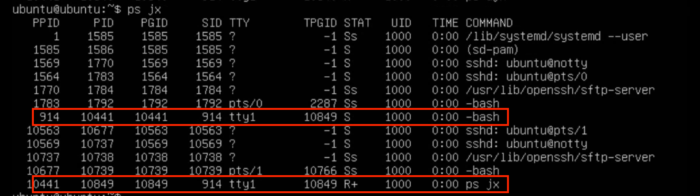
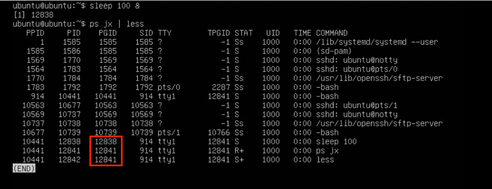

# 시스템 전체 프로세스 확인하기

```bash
$ ps aux
```

- BSD 스타일 옵션(`-` 없음)
  - `a`: 모든 사용자
  - `x`: 모든 터미널
  - `u`: 자세한 항목 출력

# 프로세스 생성

- 리눅스가 새로운 프로세스를 실행하는 방법
  - `fork()`, `execve()`시스템 콜 실행

## fork()함수

- 실행중인 프로세스로부터 새로운 프로세스를 복사하는 함수
- 실행 순서
  1. 부모 프로세스가 `fork()` 함수 실행
  2. 자식 프로세스용 메모리를 확보한 후 부모 프로세스 복사
  3. 자식, 부모 프로세스 `fork()` 함수에서 복귀
     - **함수 반환값**
     - 자식: `0`
     - 부모: `CPID`
- **복사 시 바뀌는 정보**
  - PID
  - 메모리 관련 정보
  - PPID, CPID
    - 자식프로세스의 경우 현재 자식이 없는 상태이기 때문에
    - → CPID: `-1`
- 프로세스가 분기 되어 호출 한 번에 반환값이 두 개
- 둘 중 어떤 프로세스가 먼저 실행 될지 장담 할 수 없음
  → `exit()`

### fork()의 장점

- 프로세스 생성 속도가 빠르다.
  - HDD가 아닌 Memory에서 복사
- 추가 자원없이 PP → CP 자원 상속 가능
- 시스템 관리에 효율적
  - PP가 CP 정리

## execve()함수

- 기존 프로세스를 새로운 프로세스로 전환하는 함수
- 실행 순서
  - 1. `execve()`함수 호출
  - 2. `execve()`의 인수인 실행 파일에서 프로그램을 읽어서, 메모리에 배치하는데 필요한 정보 가져옴
    - ex. `execve("echo")`
  - 3. 현재 프로세스 메모리를 새로운 프로세스 데이터로 대체

### ELF

`execve()` 함수가 동작하기 위해서는 파일 프로그램과 데이터 이외에 다음이 필요하다.

- 코드 영역의 파일 오프셋, 크기 및 메모리 맵 시작 주소
- 데이터 영역의 파일 오프셋, 크기 및 메모리 맵 시작 주소
- 최초로 실행할 명령의 메모리 주소(엔트리 포인트)
  리눅스에서 실행 파일은 위 정보를 ELF<sub>Executable and Linking Format</sub>포맷으로 저장한다.

#### no-pie

```bash
$ cc -o pause -no-pie pause.c
```

- `no-pie`: PIE 무효화
  - ASLR에 대응하는 프로그램을 PIE<sub>Position Independent Executable</sub>라고 한다.
  - ASLR<sub>Address Space Layout Randomization</sub>
    - 리눅스 커널의 보안 기능
    - **프로그램을 실행할때마다 다른 주소에 매핑**
    - 코드나 데이터가 고정 주소에 존재했을 때 받게되는 공격을 피할 수 있다.
- 실행 파일이 PIE인지 아닌지 확인하는 방법

```bash
$ file pause
> pause: ELF 64-bit LSB executable # no pie
> wait: ELF 64-bit LSB shared object # pie
```

### readelf -h

```bash
$ readelf -h pause
ELF Header:
  Magic:   7f 45 4c 46 02 01 01 00 00 00 00 00 00 00 00 00
  Class:                             ELF64
  Data:                              2's complement, little endian
  Version:                           1 (current)
  OS/ABI:                            UNIX - System V
  ABI Version:                       0
...
  Version:                           0x1
  Entry point address:               0x401050
  # Entry point 주소
```

- 프로그램 시작 주소 확인(엔트리 포인트 주소) 확인

### readelf -S

```bash
$ readelf -S pause
  [Nr] Name              Type             Address           Offset
       Size              EntSize          Flags  Link  Info  Align


  [15] .text             PROGBITS         0000000000401050  00001050
       0000000000000175  0000000000000000  AX       0     0     16


  [25] .data             PROGBITS         0000000000404020  00003020
       0000000000000010  0000000000000000  WA       0     0     8

```

- 코드와 데이터의 파일 오프셋, 크기, 시작 주소 확인
- 실행 파일은 여러 영역으로 나뉘어져있고 각각을 섹션<sub>section</sub>이라고 부른다.
- Name: 섹션명
- Address: 메모리 맵 시작 주소
  - .text(코드 영역) - 0000000000401050
  - .data(데이터 영역) -0000000000404020
- Offset: 파일 오프셋
- Size: 크기

```bash
$ ./pause &
```

- 실행 시킨 프로세스 메모리맵 확인하기
- 실행 프로세스의 메모리맵 정보는 `/proc/<PID>/maps`에 저장됨

```bash
00401000-00402000 r-xp 00001000 fd:00 917791                             /root/pause # 코드 영역
00404000-00405000 rw-p 00003000 fd:00 917791                             /root/pause # 데이터 영역
```



- 둘다 영역 내에 있는 걸 확인 할 수 있다.



- `no-pie` 옵션 덕에 실행 파일을 한 번 더 돌려도 영역이 같음

## 새 프로세스를 실행하지 않는 이유

- 처음부터 새 프로세스를 만들지 않고 `fork()`, `execve()`를 통해 프로세스를 생성하는 이유
  - 프로세스 구조체 재활용을 위해서이다.
  - 이미 만들어진 PCB, 메모리 영역, 부모-자식 관계를 그대로 활용 가능하기 때문에 편리하다는 장점이 있음.

# 프로세스의 부모 자식관계

- 컴퓨터 부팅 시 리눅스 커널이 init 프로세스 기동
- init 프로세스가 자식 프로세스 기동 - 자식 프로세스가 ....반복 트리 구조 생성

```bash
$ pstree -p
systemd(1)─┬─ModemManager(963)─┬─{ModemManager}(1002)
           │                   └─{ModemManager}(1018)
           ├─VGAuthService(758)
           ├─atd(896)
           ├─dnsmasq(1231)───dnsmasq(1232)
# 생략
```

- 모든 프로세스의 조상은 init(systemd)프로세스
  - init 프로세스를 제외한 모든 사용자 프로세스는 `fork()`시스템 호출의 결과다.

# exit()

- 부모 프로세스에게 자식 프로세스가 종료되었음을 알림

# wait()

- 자식 프로세스가 끝나길 기다렸다가 다음 문장을 실행

## 좀비 프로세스와 고아 프로세스

- 좀비 프로세스
  - 자식 프로세스가 종료되었지만 **부모 프로세스가 종료상태를 확인하지 않은 상태** (`exit()`)의 프로세스
  - 이 상태로 부모 프로세스가 종료되면 init에 붙음
- 고아 프로세스
  - `wait()`계열 시스템 콜 실행 전에 **부모 프로세스가 먼저 종료된 상태**
  - 커널은 init을 고아 프로세스의 부모로 지정한다.
- init은 주기적으로 `wait()`을 돌려 자원을 정리함

# 시그널

- 프로세스끼리 통신하여 외부에서 실행 순서를 강제적으로 바꾸는 방법
- `Ctrl + C` → SIGINT
  - 인터럽트의 의미(프로그램을 종료)

## 시그널 핸들러

- 프로세스는 시그널에 미리 시그널 핸들러를 등록해둔다.
- 시그널을 수신하면 프로세스에 대해 하던 처리를 중단하고 시그널 핸들러에 등록한 처리 동작, 완료 시 원래 하던 일을 재개

# 세션

- 터미널 에뮬레이터 또는 ssh를 사용하여 로그인 했을 때의 로그인 세션을 말한다.
- 모든 세션에는 해당 세션을 제어하는 단말이 있음
  - 세션을 제어하는 터미널 → 제어 터미널<sub>controlling terminal</sub>
- 세션 리더<sub>Session leader</sub>
  - `setsid()`로 세션을 생성한 프로세스
  - 주로 쉘(bash)이다.
  - PID = SID



- 세션에 해당하는 단말이 행업하거나, 연결이 끊기는 경우 세션 리더에게 SIGHUP 시그널 보냄
  - 단말의 연결이 끊겨도 종료하지 않게 하는 법
    - `nohup`
      - `SIGHUP` 시그널 무시
    - `disown`
      - 세션 리더 관리 대상에서 제외
      - bash가 `SIGHUP` 시그널을 보내지 않음

## 프로세스 그룹

- 리눅스는 프로세스를 그룹으로 묶어 한꺼번에 관리한다.
- 프로세스 그룹 = 잡
  - 쉘 입장에서 바라본 작업 단위
- 프로세스 그룹 리더<sub>Process Group leader</sub>
  - PID=PGID
- 프로세스 그룹에 시그널 보내기

```bash
$ kill -100
```

- 음수값을 지정
- PGID가 100인경우 -100

### 포그라운드 & 백그라운드

- 세션 내부 프로세스 그룹은 두 종류로 나눌 수 있음
- 포그라운드 프로세스 그룹
  - 세션당 한 개만 존재
  - 단말에 직접 접근 가능
- 백그라운드 프로세스 그룹
  - 단말을 조작하려고 하면 SIGSTOP을 받았을 때 처럼 실행 중단
    - `fg`를 통해 포그라운드로 전환될 때까지 상태 유지

```bash
$ sleep 100 &
$ ps jx | less
```



- 포그라운드 PGID: 12841
  - 프로세스 그룹 리더:`ps jx`
- 백그라운드 PGID: 12838

## 데몬

- 시스템 시작부터 종료까지 계속해서 상주하는 프로세스
- 특징
  - 단말이 할당되지 않음
  - 독자적인 세션을 가짐
  - init 프로세스를 부모로 둠

```bash
$ ps ajx
   PPID     PID    PGID     SID TTY        TPGID STAT   UID   TIME COMMAND
      1     948     948     948 ?             -1 Ss       0   0:00 sshd: /usr/sbin/sshd -D [listener] 0 of 10-100 startups
```

- PPID(`1`)-부모 프로세스 systemd
- TTY(`?`)-단말이 존재하지 않음
  - 단말이 없기 때문에 `SIGHUP` 시그널을 다르게 받아들인다.
  - 보통 설정 파일을 다시 읽어들이는 것으로 해석
- PID = SID = PGID
  - 독자적인 세션을 가지기 때문
